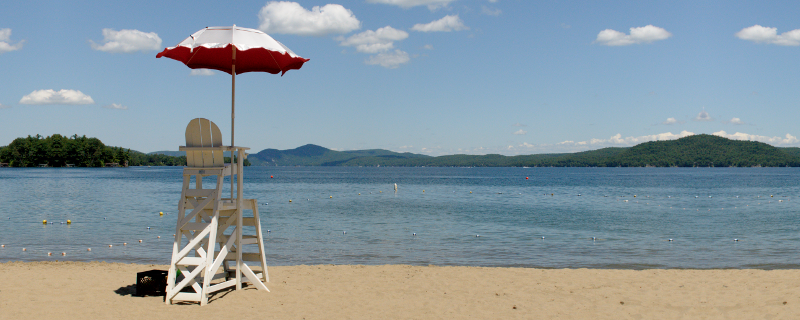

# Vacation Blog

This vacation blog is a personal project of mine. The purpose is to create
a custom way for me to keep a blog while my wife and I are traveling on
vacation.

The reasons standard blogs don't work for me are:

 - I want to run the same blog on multiple servers: my home Linux system,
   my Linux laptop that I am traveling with, and my public website. I want
   to be able to synchronize between those different servers.

 - I want to connect the blog directly to my photo archive while writing
   the blog entries. The typical workflow consists of first uploading the
   day's photos to the local copy of the photo archive, doing any
   labelling and post-processing in the photo archive, and then write
   the blog entry with references to the photos in the archive.

For this vacation blog project, I intend to make the photo archive connection
a plugin, so that others will be able to create plugins to other photo
repositories.

## Major Parts of the Vacation Blog

The vacation blog consists of three major pieces:

1. The database, which is assumed to be a mySQL database. It should be
   relatively easy to modify the blog to use other SQL databases.

2. Server-side functionality, written in PHP. The server-side functionality
   mostly consists of a series of APIs available to the client-side code.

3. Client-side functionality, written in JavaScript using React.js technology. See [documentation/datastructure.md].

## Prerequisites

The following must be installed and running in order to run the vacation blog:

 - Web server (I use Apache's httpd server).

 - PHP enabled on the Web server.

 - A mySQL database.

 - Node (version 4 or higher), which includes NPM to build and package
   the client-side part of the website.

The following are needed to do development work on the website:

 - phpunit to run server-side unit tests.

## Getting Started

The following steps explain how to get started using the vacation blog.
As the project matures, these steps may get cleaned up a bit.

 - Obtain the source from GitHub (obviously). The GitHub project contains
   both the server-side and client-side code.

 - Obtain all the NPM modules by running the command

   `$ npm install`

 - Build the client-side part of the application by running the command

   `$ npm run browserify`

 - Create a MySQL database that will house the vacation blog. The following
   example creates a database named "blog":

   `mysql> CREATE DATABASE blog;`

 - Create a `vacationblog.ini` file in the root of the vacationblog
   directory structure that contains the setup for the project. The
   `vacationblog.ini-default` can be used as a starting point.

   Note: the `vacationblog.ini` file should be configured so that it can
   only be read by the web server, and cannot be accessed over the web.
   The `.htaccess` file in the vacationblog project prevents access through
   the web on systems that are configured to check htaccess files.

   Update the following four entries to match the database configuration:

        hostname = 'localhost'
        username = 'dbuser'
        password = 'secret'
        dbname = 'blog'

   Note: the following source files need to be updated if the location of
   the `vacationblog.ini` file is changed:

        site/database/database.php
        unittest/common.php

 - Make the content of the `site/` folder accessible from the web server.
   This will be the on-line address of the vacation blog.

 - Navigate in a browser to the following location (assuming the `site/`
   folder has been mounted on the website as `.../site/`):

        http://.../site/api/CreateTables.php

   to run the script that creates the tables in the database. The first time
   this script is run, it will show an error that the blogSettings table
   does not exist; this is expected. This script will ask for the information
   of the user who will be the administrator of the vacation blog system.
   The username and password provided here will be used to create a user
   in the vacation blog database who will be able to administer the
   vacation blog system.

   Note: once the CreateTables script successfully initializes the database,
   it won't ask for the administrator information again. On subsequent
   runs, the script will check if the database structure is up-to-date
   with the application source code, and update the database if needed.

At this point, the vacation blog site has been initialized and is ready for
use. Navigate to the site's URL (`http://.../site/`) to see the home page.
It should now be possible to login as the user created above and start
creating trips, adding content etc.

## Start Developing

In order to start developing, first make sure that the local copy of the
vacation blog works, by following the above steps.

To prepare for server-side unit testing, the test scripts need to know how
to connect to the server. The `apiroot` entry in the `vacationblog.ini`
file should be updated to match URL for the API functions

    apiroot = 'http://localhost/vacationblog/site/api/'

(note the trailing slash).

Make sure that all unit testing works. The command:

    phpunit unittest/

should run all the server-side tests, using the `phpunit` tool. The command:

    npm run test

should run all the client-side tests, using `mocha`, and collect code coverage
for the client-side testing using `istanbul`. Code coverage is collected in
HTML format in the `coverage/lcov-report` folder.

## Attributions

Default site banner: Silver Bay, New York. Photographed July 11, 2014 by Eric Grivel. To the extent possible under law, Eric Grivel has waived all copyright and related or neighboring rights to this Photo #20140711-123441. This work is published from: United States.
